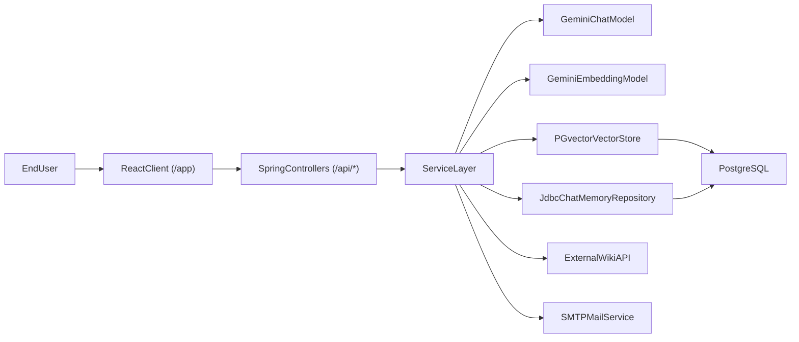

# DocuSearch AI Notebook

Spring AI 기반 개인 포트폴리오 프로젝트.  
문서 기반 RAG 검색, 대화 메모리 채팅, 커뮤니티 게시판, 관리자 운영 기능을 하나의 웹앱으로 통합해 **AI 백엔드 역량 + 풀스택 구현 역량 + 제품 관점 문제해결 능력**을 보여주는 데 집중.

## 1) 프로젝트 개요

### 왜 만들었는가
- 단순 챗봇이 아니라, 실제 업무/학습 문서를 연결한 사내 데이터용 **실용형 AI 노트 제품** 구축 목표.
- 백엔드 중심으로 시작했지만, 사용자 경험까지 검증하기 위해 React 프론트와 운영 기능(관리자/메일/배포)까지 구현.

### 어떤 문제를 해결하는가
- 문서가 흩어져 있으면 필요한 정보를 찾는 시간 증가.
- 파일/URL/위키 문서를 벡터 DB에 적재하고, 대화 중 문맥 검색(RAG)을 결합해 빠르게 답을 찾도록 설계.

## 2) 핵심 기능

### AI Notebook
- Notebook 스타일 3패널 UI(소스/채팅/스튜디오) 제공
- 대화 히스토리 저장/조회/삭제 지원
- 대화 제목 자동 요약 생성(첫 응답 기반)
- 세션 만료 시 API 401 처리 후 로그인 화면으로 유도

### RAG 문서 적재
- 업로드 지원: `txt`, `md`, `markdown`, `pdf`, `docx`, `pptx`
- URL 문서 적재 지원
- 외부 위키 페이지 선택 적재 지원
- 문서 청크 분할 후 PGvector 저장, 문서 목록 조회/삭제 지원

### 커뮤니티/운영 기능
- 게시글/댓글 CRUD 및 Markdown 렌더링
- 관리자 전용 사용자 일괄 삭제
- 관리자 전용 업데이트 메일 일괄 발송

## 3) 기술 스택

### Backend
- Java 21
- Spring Boot 3.5
- Spring Security (Form Login + Role 기반 인가)
- Spring AI 1.1 (Gemini Chat + Embedding, Chat Memory JDBC, VectorStore)
- Spring Data JPA
- PostgreSQL + PGvector
- Maven, Jib(컨테이너 이미지 빌드/푸시)

### Frontend
- React 19 + TypeScript + Vite
- React Router
- ESLint

## 4) 아키텍처 개요



## 5) 실행 방법 (로컬 개발)

> 공개 저장소 기준으로 민감 정보 익명화 적용. 실제 값은 환경변수로 주입해 사용.

### 사전 요구사항
- JDK 21
- Node.js 20+ / npm
- PostgreSQL (PGvector 확장 사용 가능 환경)

### 환경변수
- `GEMINI_API_KEY`: Gemini API 키
- `DOORAY_ACCOUNT`: SMTP 계정
- `DOORAY_PASSWORD`: SMTP 비밀번호

### 로컬 프로필/DB 설정
- 로컬 실행은 `home` 프로필 기준.
- `src/main/resources/application-home.yaml`에서 로컬 PostgreSQL 접속 정보를 본인 환경에 맞게 설정.
- PGvector 사용을 위해 DB 확장(`vector`, `hstore`, `uuid-ossp`)이 활성화된 환경 권장.

### 백엔드 실행
```bash
# Windows PowerShell
./mvnw.cmd spring-boot:run -Dspring-boot.run.arguments="--spring.profiles.active=home"
```

### 프론트엔드 개발 서버 실행
```bash
cd webapp
npm install
npm run dev
```

- 기본 프론트 URL: `https://localhost:5173/app/`
- Vite 프록시가 `/api`, `/login`, `/logout` 요청을 Spring 서버(`https://localhost:8080`)로 전달.

### 통합 빌드(정적 파일 반영)
```bash
cd webapp
npm run build
```

- 빌드 결과물은 `src/main/resources/static/app`에 생성.
- 이후 백엔드 실행 시 `/app` 경로에서 정적 리소스 제공.

## 6) 배포 방식

- `scripts/docker-build-push.cmd` 스크립트로 다음을 자동화.
  - React 프로덕션 빌드
  - Jib 기반 컨테이너 이미지 빌드
  - 태그 생성 후 레지스트리 푸시

> 공개 README에서는 사내/내부망 레지스트리 상세 주소 제외.

## 7) 프로젝트 구조

```text
spring-ai/
├─ src/main/java/...         # Spring Boot API, 서비스, 보안, 도메인
├─ src/main/resources/...    # 설정, 템플릿, 정적 리소스
├─ src/test/java/...         # 테스트 코드
├─ webapp/                   # React + TypeScript + Vite
└─ scripts/                  # 배포 보조 스크립트
```

## 8) 참고 문서

- [RAG-PGVECTOR-DESIGN](docs/RAG-PGVECTOR-DESIGN.md)
- [Dooray Wiki API Guide](api_guide/dooray_wiki_api_guide.md)

## 9) 작동 예시


