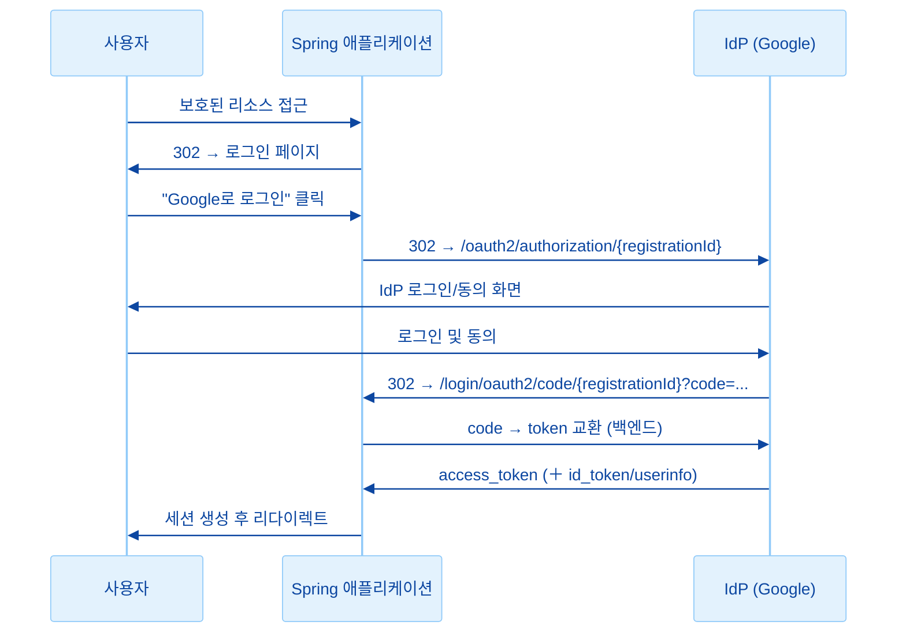
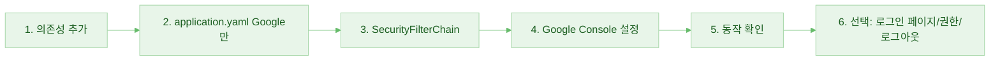

# OIDC(OAuth2) 로그인 도입 플랜

Spring Security 공식 문서(OAuth 2.0 Login, OpenID Connect)를 기준으로 한 소셜 로그인 도입 플랜입니다.

**우선 적용 범위**: **Google OIDC만** 먼저 구현하고, 동작 안정화 후 Naver/Kakao를 추가하는 단계적 접근을 사용합니다.

---

## 1. 현재 프로젝트 상황

| 항목            | 내용                           |
| --------------- | ------------------------------ |
| Spring Boot     | 3.5.9                          |
| Spring Security | **미도입** (의존성 추가 필요)  |
| 설정 파일       | `application.yaml`             |
| 프론트          | Thymeleaf (서버 사이드 렌더링) |

---

## 2. 전체 흐름 (Authorization Code Grant)



-   **Redirect URI 기본값**: `{baseUrl}/login/oauth2/code/{registrationId}`  
    (예: `http://localhost:8080/login/oauth2/code/google`)
-   Phase 1에서는 **Google Cloud Console**에 위 Redirect URI를 **정확히** 등록합니다.

---

## 3. 플랜 단계 요약 (Phase 1: Google OIDC)

| 단계 | 내용                                                           | 공식 문서 근거                |
| ---- | -------------------------------------------------------------- | ----------------------------- |
| 1    | Spring Security + OAuth2 Client 의존성 추가                    | Core Configuration            |
| 2    | `application.yaml`에 **Google** client만 등록                  | Property Mappings             |
| 3    | `SecurityFilterChain`으로 인증/인가 및 `oauth2Login()` 설정    | Overriding Auto-configuration |
| 4    | Google Cloud Console에서 Redirect URI 및 Client ID/Secret 설정 | —                             |
| 5    | (선택) 커스텀 로그인 페이지, 권한 매핑, OIDC 로그아웃          | Advanced, OIDC Logout         |

---

## 4. 상세 플랜

### 4.1 의존성 추가 (pom.xml)

-   **spring-boot-starter-security**
-   **spring-boot-starter-oauth2-client** (OAuth2 Login에 필요)

Spring Boot 3.5.x는 Spring Security 6.x를 사용하며, OAuth2 Login은 Authorization Code Grant + (OIDC인 경우) UserInfo/ID Token으로 동작합니다.

---

### 4.2 Provider 설정 (Phase 1: Google만)

**Google**은 `CommonOAuth2Provider`에 포함되어 있어, **registrationId = `google`** 이면 authorization-uri, token-uri, user-info-uri 등이 자동 설정됩니다. **client-id, client-secret만** 설정하면 됩니다.

#### Google (Phase 1에서 사용)

-   Google Cloud Console → API 및 서비스 → 사용자 인증 정보 → OAuth 2.0 클라이언트 ID 생성 (웹 애플리케이션).
-   **승인된 리디렉션 URI**: `http://localhost:8080/login/oauth2/code/google` (운영 환경은 별도 도메인 추가).

#### Phase 2 (추가 시): Naver / Kakao

-   Naver/Kakao는 `CommonOAuth2Provider`에 없으므로 **Custom Provider**로 `spring.security.oauth2.client.provider.*[providerId]*` 아래에 authorization-uri, token-uri, user-info-uri 등을 직접 지정해야 함.
-   Naver: [네이버 개발자센터](https://developers.naver.com/) — 콜백 URL `http://localhost:8080/login/oauth2/code/naver`.
-   Kakao: [Kakao Developers](https://developers.kakao.com/) — Redirect URI `http://localhost:8080/login/oauth2/code/kakao`.
-   상세 엔드포인트 및 `user-name-attribute` 등은 각 IdP 문서를 참고하여 Phase 2에서 추가.

---

### 4.3 application.yaml 설정 (Phase 1: Google만)

```yaml
spring:
    security:
        oauth2:
            client:
                registration:
                    google:
                        client-id: ${GOOGLE_CLIENT_ID}
                        client-secret: ${GOOGLE_CLIENT_SECRET}
                        scope: openid, profile, email
```

-   `registrationId`가 `google`이면 provider 기본값이 적용되므로 **provider 블록 없이** 위만으로 동작.
-   client-id, client-secret은 환경변수로 관리하고, **저장소에 직접 넣지 않는 것** 권장.
-   **Phase 2**에서 Naver/Kakao를 추가할 때는 `registration`에 naver, kakao를 넣고, `provider` 아래에 각 IdP 엔드포인트를 정의하면 됨.

---

### 4.4 SecurityFilterChain (공식 “Register a SecurityFilterChain @Bean” 예시 확장)

-   `@EnableWebSecurity` + `SecurityFilterChain` Bean.
-   `authorizeHttpRequests`: 인증이 필요한 경로와 permitAll할 경로 구분 (예: `/`, `/login`, `/css/**`, `/error` 등은 permitAll).
-   `oauth2Login(withDefaults())`: 기본 로그인 처리 경로 `/login/oauth2/code/*` 사용.
-   (선택) `formLogin()` 비활성화하고 OAuth만 사용할지, 로그인 페이지만 커스텀할지 결정.

공식 문서 예시:

```java
http
  .authorizeHttpRequests((authorize) -> authorize
    .anyRequest().authenticated()
  )
  .oauth2Login(withDefaults());
```

실제로는 정적 리소스·로그인 페이지·헬스 등은 `.permitAll()`, 나머지는 `.authenticated()`로 조정.

---

### 4.5 (선택) 커스텀 로그인 페이지

-   기본: `DefaultLoginPageGeneratingFilter`가 자동 생성하는 로그인 페이지에 등록된 OAuth Client 링크가 노출됨. Phase 1에서는 **Google** 링크만 노출.
-   링크 형식: `/oauth2/authorization/{registrationId}` (Phase 1: `/oauth2/authorization/google`).
-   커스텀 로그인 페이지를 쓰려면:
    -   `oauth2Login(oauth2 -> oauth2.loginPage("/login"))` 등으로 로그인 URL 지정.
    -   해당 경로를 처리하는 `@Controller`에서 Thymeleaf 템플릿 렌더링.
    -   템플릿에 `/oauth2/authorization/google` 링크 배치 (Phase 2에서 naver, kakao 추가 시 해당 링크 추가).

---

### 4.6 (선택) UserInfo / 권한 매핑

-   로그인 후 권한을 scope/claim 기반으로 매핑하려면:
    -   **GrantedAuthoritiesMapper** Bean 등록 (공식: “Using a GrantedAuthoritiesMapper”), 또는
    -   **OidcUserService** 커스텀 (공식: “OpenID Connect 1.0 UserService”). Google은 OIDC이므로 `OidcUser` 사용.
-   Phase 2에서 Naver/Kakao 추가 시에는 OAuth2 UserInfo 형식에 맞춰 `user-name-attribute` 등을 각 IdP 문서에 따라 설정.

---

### 4.7 (선택) OIDC 로그아웃

-   공식 문서 “OIDC Logout”: RP-Initiated Logout 등.
-   `OidcClientInitiatedLogoutSuccessHandler` + `logout()` DSL에서 Google `issuer-uri`를 사용하면 IdP와 연동 로그아웃 가능.

---

## 5. 구현 순서 제안 (Phase 1: Google OIDC)



1. **의존성**: `spring-boot-starter-security`, `spring-boot-starter-oauth2-client`
2. **설정**: `application.yaml`에 **Google** registration만 등록 (client-id, client-secret, scope)
3. **보안 설정**: `SecurityFilterChain`에서 경로별 permit/authenticated 및 `oauth2Login(withDefaults())`
4. **Google Console**: OAuth 2.0 클라이언트 ID 생성, 승인된 리디렉션 URI `http://localhost:8080/login/oauth2/code/google` 등록
5. **테스트**: Google 로그인 플로우 및 세션 확인
6. **선택**: 커스텀 로그인 페이지, GrantedAuthoritiesMapper/OidcUserService, OIDC 로그아웃

**Phase 2**에서 Google 동작이 안정되면 Naver/Kakao를 `registration` 및 `provider`에 추가하면 됨.

---

## 6. 참고 공식 문서

-   [OAuth 2.0 Login (Servlet)](https://docs.spring.io/spring-security/reference/servlet/oauth2/login/index.html)
-   [Core Configuration](https://docs.spring.io/spring-security/reference/servlet/oauth2/login/core.html) — Boot 속성 매핑, CommonOAuth2Provider, Custom Provider
-   [Advanced Configuration](https://docs.spring.io/spring-security/reference/servlet/oauth2/login/advanced.html) — 로그인 페이지, UserInfo, 권한 매핑
-   [OIDC Logout](https://docs.spring.io/spring-security/reference/servlet/oauth2/login/logout.html)

---

다음 단계로 **Phase 1(Google OIDC)** 구현을 진행한 뒤, **커스텀 로그인 페이지 필요 여부**를 정하면 그에 맞춰 코드 변경 포인트를 이어서 정리할 수 있습니다.
