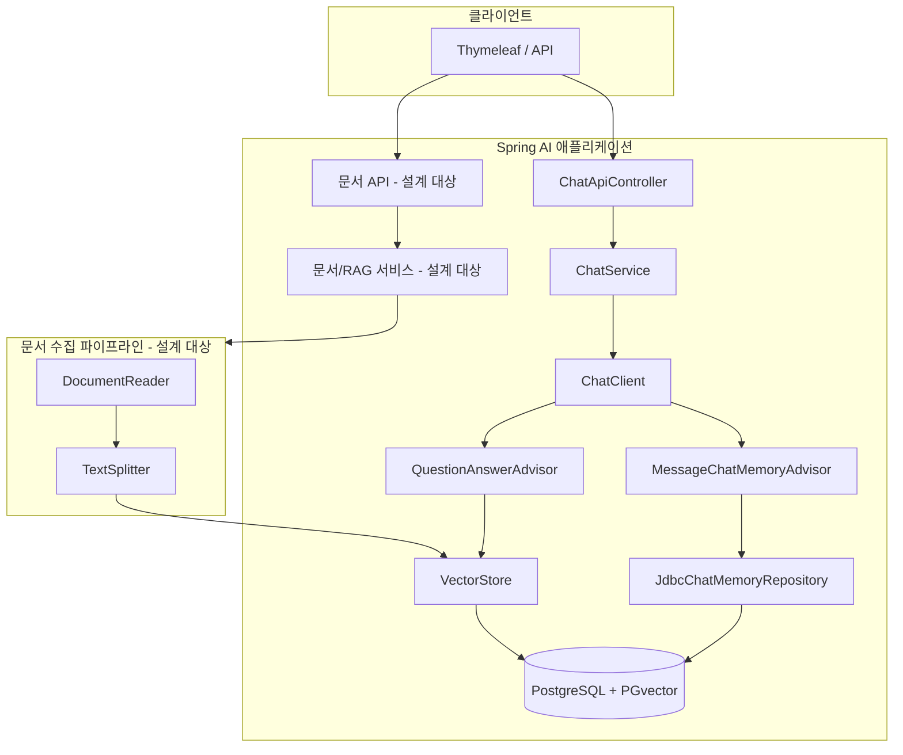
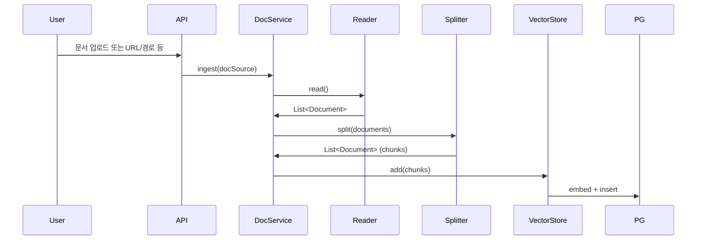
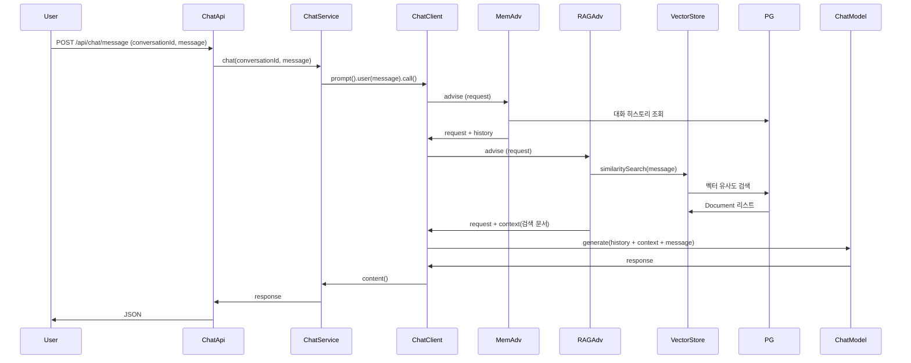

# PGvector 기반 RAG 설계

현재 `spring-ai-advisors-vector-store`와 `spring-ai-starter-vector-store-pgvector` 의존성이 추가된 상태에서, PostgreSQL + PGvector를 이용한 RAG(Retrieval-Augmented Generation) 구현 방안을 정리한다.

---

## 1. 전체 아키텍처



- **기존**: `ChatClient` + `MessageChatMemoryAdvisor` → 대화 기록만 사용.
- **추가**: `QuestionAnswerAdvisor` + `VectorStore`(PGvector) → 질의 시 관련 문서를 검색해 컨텍스트로 넣는 RAG.
- **문서 수집**: 외부 문서를 읽어 쪼갠 뒤 벡터로 저장하는 파이프라인(설계 대상).

---

## 2. 전제 조건 및 추가 의존성

### 2.1 DB 확장

PGvector 사용을 위해 PostgreSQL에 다음 확장이 필요하다.

- `vector`
- `hstore`
- `uuid-ossp`

로컬 개발 시 예: `docker run ... pgvector/pgvector` 이미지 사용.

### 2.2 EmbeddingModel (필수)

`PgVectorStore`는 문서/쿼리 임베딩을 위해 **EmbeddingModel** 빈이 필요하다.  
현재 프로젝트는 **Chat 전용** `spring-ai-starter-model-google-genai`만 있으므로, **임베딩 전용 스타터를 추가**해야 한다.

| 목적       | 의존성                                      | 비고 |
|------------|---------------------------------------------|------|
| RAG 임베딩 | `spring-ai-starter-model-google-genai-embedding` | Google `text-embedding-004` 등 사용, 차원은 768(기본) |

- Chat과 Embedding은 동일한 `spring.ai.google.genai` 연결 정보(api-key 등)를 공유할 수 있다.
- PGvector `dimensions`는 EmbeddingModel 출력 차원과 맞춰야 한다. Google 기본 768이면 768로 설정(또는 생략 시 모델에서 조회).

---

## 3. 설정 설계

### 3.1 application.yaml 추가 항목

```yaml
spring:
  ai:
    # 기존 google.genai (chat) 유지
    vectorstore:
      pgvector:
        initialize-schema: true   # vector_store 테이블 및 인덱스 자동 생성
        index-type: HNSW
        distance-type: COSINE_DISTANCE
        dimensions: 768           # Google text-embedding-004 기본값 (지정하지 않으면 EmbeddingModel에서 조회)
    # Embedding 활성화 (google-genai-embedding 스타터 추가 시)
    model:
      embedding:
        text: google-genai
```

- `initialize-schema: true`: 최초 1회 스키마 생성 후, 운영에서는 `false`로 두는 것을 권장.
- JPA `ddl-auto: validate`와 충돌하지 않도록, PGvector가 만드는 테이블(`vector_store` 등)은 JPA 엔티티에 매핑하지 않는다.

### 3.2 Bean 구성

- **VectorStore**: `spring-ai-starter-vector-store-pgvector` + `EmbeddingModel`이 있으면 **자동 구성**으로 `PgVectorStore` 빈 생성.
- **QuestionAnswerAdvisor**: `VectorStore`를 주입받아 `QuestionAnswerAdvisor.builder(vectorStore).build()` 형태로 빈 등록 후, `ChatClient`에 `defaultAdvisors`로 넣는다.

Advisor 순서(실행 순서)는 다음이 적절하다.

1. **MessageChatMemoryAdvisor** (먼저): 대화 히스토리를 프롬프트에 추가.
2. **QuestionAnswerAdvisor** (이후): 사용자 질의로 벡터 검색 후, 검색된 문서를 컨텍스트로 추가.

→ “과거 대화 + RAG 컨텍스트 + 사용자 메시지” 순으로 LLM에 전달되도록 설계.

---

## 4. 문서 수집 파이프라인 (Ingest)

RAG가 동작하려면 **미리 문서를 벡터 스토어에 넣어 두어야** 한다.



### 4.1 단계별 설계

| 단계       | 역할                | Spring AI / 구현 후보 |
|------------|---------------------|------------------------|
| 읽기       | 문서 소스 → Document | `DocumentReader` (파일, URL, DB 등), 또는 간단히 `new Document(text)` |
| 분할       | 긴 문서 → 고정 크기 청크 | `TokenTextSplitter` / `CharacterTextSplitter` 등 |
| 저장       | 청크 → 벡터화 후 저장 | `VectorStore.add(documents)` |

### 4.2 문서 소스 선택지

- **A. 파일 업로드**: Multipart 파일 → 텍스트 추출(예: Apache Tika, 또는 PDF 전용 Reader) → Split → `vectorStore.add()`.
- **B. URL/경로**: Spring AI ETL 문서의 `DocumentReader`(예: `UrlDocumentReader`, `PagePdfDocumentReader`) 사용 후 동일 파이프라인.
- **C. DB/애플리케이션 데이터**: JPA 등으로 읽은 텍스트를 `Document`로 만들어 동일하게 Split → add.

우선 **A(파일 업로드)** 또는 **B(URL)** 중 하나로 최소 파이프라인을 만든 뒤, 필요 시 C를 추가하는 방식이 구현 부담이 적다.

---

## 5. RAG 질의 흐름



- 동일한 `POST /api/chat/message`를 그대로 사용할 수 있고, `ChatClient`에 `QuestionAnswerAdvisor`만 추가하면 해당 API가 곧 “RAG가 적용된 채팅”이 된다.
- 벡터 스토어에 문서가 없으면 검색 결과가 비어 있어서, 사실상 “RAG 없이 대화만” 되는 상태가 된다.

---

## 6. API/서비스 설계 선택

### 6.1 옵션 A: 모든 채팅에 RAG 적용 (단일 채널)

- `ChatService` 생성 시 `ChatClient`에 `MessageChatMemoryAdvisor` + `QuestionAnswerAdvisor` 둘 다 `defaultAdvisors`로 등록.
- 기존 `POST /api/chat/message`만으로 “대화 기록 + RAG” 동시 사용.
- **장점**: 구현 단순, 클라이언트 변경 최소.
- **단점**: RAG가 필요 없는 대화에도 항상 벡터 검색이 수행됨(빈 결과일 뿐).

### 6.2 옵션 B: RAG 전용 채널 분리

- RAG용 `ChatClient`(QuestionAnswerAdvisor만 또는 Memory + RAG)와 일반용 `ChatClient`(Memory만)를 각각 빈으로 두고, 서비스/API에서 용도별로 선택.
- 예: `POST /api/chat/message` = 기존 일반 채팅, `POST /api/rag/ask` = RAG 전용.
- **장점**: 용도별로 리소스·동작을 명확히 분리.
- **단점**: API·서비스·프론트가 두 가지 경로를 구분해야 함.

### 6.3 권장

- 먼저 **옵션 A**로 통합 구현한 뒤, “RAG 없이 빠른 채팅”이 필요해지면 **옵션 B**처럼 RAG 전용 엔드포인트/빈을 추가하는 방식이 단계적이다.

---

## 7. 구현 체크리스트

| # | 항목 | 내용 |
|---|------|------|
| 1 | 의존성 | `spring-ai-starter-model-google-genai-embedding` 추가 |
| 2 | 설정 | `application.yaml`에 `spring.ai.vectorstore.pgvector.*`, `spring.ai.model.embedding.text` 추가 |
| 3 | DB | PostgreSQL에 vector/hstore/uuid-ossp 확장 확인, 필요 시 `initialize-schema: true`로 1회 스키마 생성 |
| 4 | Config | `QuestionAnswerAdvisor` 빈 등록 후 `ChatClient`에 `MessageChatMemoryAdvisor`와 함께 `defaultAdvisors`로 등록 |
| 5 | Advisor 순서 | Memory 먼저, RAG 나중 (order 값으로 제어) |
| 6 | 문서 수집 | DocumentReader + TextSplitter + `VectorStore.add()` 파이프라인 구현 (파일 업로드 또는 URL 중 1차 선택) |
| 7 | API | 문서 수집용 API (예: `POST /api/documents/ingest`) 설계·구현 |
| 8 | (선택) | topK, similarityThreshold 등 QuestionAnswerAdvisor 파라미터를 설정/프로퍼티로 노출 |

---

## 8. 참고

- [Spring AI - PGvector](https://docs.spring.io/spring-ai/reference/api/vectordbs/pgvector.html)
- [Spring AI - Advisors API](https://docs.spring.io/spring-ai/reference/api/advisors.html)
- [Spring AI - Retrieval Augmented Generation](https://docs.spring.io/spring-ai/reference/api/retrieval-augmented-generation.html)
- [Google GenAI Text Embeddings](https://docs.spring.io/spring-ai/reference/api/embeddings/google-genai-embeddings-text.html) (차원·task-type 등)
