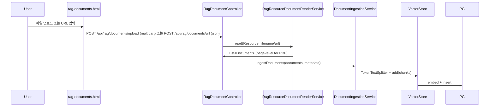
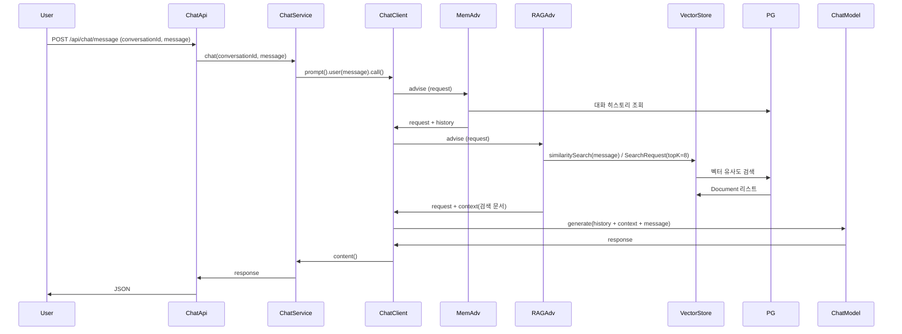

# PGvector 기반 RAG 설계 (구현 반영)

현재 프로젝트에 구현된 **Vector DB 적재(파일/URL)** 및 **RAG 검색(QuestionAnswerAdvisor)**까지의 흐름을 기준으로, PostgreSQL + PGvector 기반 RAG(Retrieval-Augmented Generation) 구성을 정리한다.

---

## 1. 전체 아키텍처

```mermaid
flowchart TB
    subgraph Client["클라이언트"]
        ChatUI["/chat (chat.html)"]
        RagUI["/rag/documents (rag-documents.html)"]
    end

    subgraph App["Spring AI 애플리케이션"]
        ChatApi[ChatApiController]
        RagDocApi[RagDocumentController]
        RagPage[RagDocumentPageController]
        ChatSvc[ChatService (RAG 적용)]
        UrlSvc[RagUrlIngestionService]
        ReaderSvc[RagResourceDocumentReaderService]
        IngestSvc[DocumentIngestionService]
        ManageSvc[RagDocumentManagementService]

        ChatClient[ChatClient]
        MemAdv[MessageChatMemoryAdvisor]
        RAGAdv[QuestionAnswerAdvisor]

        ChatClient --> MemAdv
        ChatClient --> RAGAdv
        RAGAdv --> VS[VectorStore]
        VS --> PG[(PostgreSQL + PGvector)]
        MemAdv --> JdbcMem[JdbcChatMemoryRepository]
        JdbcMem --> PG

        RagDocApi --> UrlSvc
        RagDocApi --> ReaderSvc
        UrlSvc --> ReaderSvc
        UrlSvc --> IngestSvc
        ReaderSvc --> IngestSvc
        RagDocApi --> ManageSvc
        ManageSvc --> VS
    end

    ChatUI --> ChatApi
    ChatApi --> ChatSvc
    ChatSvc --> ChatClient

    RagUI --> RagPage
    RagUI --> RagDocApi
```

-   **기존**: `ChatClient` + `MessageChatMemoryAdvisor` → 대화 기록만 사용.
-   **RAG 적용(구현됨)**: `QuestionAnswerAdvisor` + `VectorStore`(PGvector) → 질의 시 관련 문서를 검색해 컨텍스트로 넣는 RAG.
-   **문서 수집/적재(구현됨)**: 파일 업로드/단일 URL 입력으로 문서를 읽고(Reader) → 청크로 분할(TokenTextSplitter) → VectorStore(PGvector)에 저장.

---

## 2. 전제 조건 및 추가 의존성

### 2.1 DB 확장

PGvector 사용을 위해 PostgreSQL에 다음 확장이 필요하다.

-   `vector`
-   `hstore`
-   `uuid-ossp`

로컬 개발 시 예: `docker run ... pgvector/pgvector` 이미지 사용.

### 2.2 EmbeddingModel (필수)

`PgVectorStore`는 문서/쿼리 임베딩을 위해 **EmbeddingModel** 빈이 필요하다.  
현재 프로젝트는 **Chat 전용** `spring-ai-starter-model-google-genai`만 있으므로, **임베딩 전용 스타터를 추가**해야 한다.

| 목적       | 의존성                                           | 비고                                                  |
| ---------- | ------------------------------------------------ | ----------------------------------------------------- |
| RAG 임베딩 | `spring-ai-starter-model-google-genai-embedding` | Google `text-embedding-004` 등 사용, 차원은 768(기본) |

-   Chat과 Embedding은 동일한 `spring.ai.google.genai` 연결 정보(api-key 등)를 공유할 수 있다.
-   PGvector `dimensions`는 EmbeddingModel 출력 차원과 맞춰야 한다. Google 기본 768이면 768로 설정(또는 생략 시 모델에서 조회).

### 2.3 DocumentReader 모듈 (HTML/Markdown/PDF)

단일 URL 적재와 PDF 적재를 위해, Spring AI의 문서 reader 모듈(HTML/Markdown/PDF)이 필요하다.

-   **HTML**: `spring-ai-jsoup-document-reader`
-   **Markdown**: `spring-ai-markdown-document-reader`
-   **PDF**: `spring-ai-pdf-document-reader` (내부적으로 PDFBox 사용)

### 2.4 PDF OCR (멀티모달 LLM)

스캔 PDF처럼 **텍스트 추출이 거의 되지 않는 페이지**는 OCR이 필요하다. 현재 구현은 다음 방식이다.

-   **1차**: PDFBox 텍스트 추출 (페이지 단위)
-   **2차(fallback)**: 페이지를 PNG로 렌더링 → **멀티모달 LLM(Gemini 등)**에게 OCR 요청 → 결과 텍스트를 Document로 저장

→ OCR은 비용/지연이 커질 수 있으므로, 텍스트 길이 임계치(`PDF_OCR_MIN_TEXT_LENGTH`) 기반으로 제한한다.

---

## 3. 설정 설계

### 3.1 application.yaml 추가 항목

```yaml
spring:
    ai:
        # Google GenAI Chat/Embedding
        google:
            genai:
                api-key: ${GEMINI_API_KEY}
                embedding:
                    api-key: ${GEMINI_API_KEY}
                    text:
                        options:
                            model: text-embedding-004
                            dimensions: 768

        vectorstore:
            pgvector:
                initialize-schema: true # vector_store 테이블 및 인덱스 자동 생성
                index-type: HNSW
                distance-type: COSINE_DISTANCE
                dimensions: 768 # Google text-embedding-004 기본값 (지정하지 않으면 EmbeddingModel에서 조회)
        # Embedding 활성화 (google-genai-embedding 스타터 추가 시)
        model:
            embedding:
                text: google-genai
```

-   `initialize-schema: true`: 최초 1회 스키마 생성 후, 운영에서는 `false`로 두는 것을 권장.
-   JPA `ddl-auto`와 충돌하지 않도록, PGvector가 만드는 테이블(`vector_store` 등)은 JPA 엔티티에 매핑하지 않는다. (현재 프로젝트는 개발 편의를 위해 `update` 설정을 사용 중)

### 3.2 Bean 구성

-   **VectorStore**: `spring-ai-starter-vector-store-pgvector` + `EmbeddingModel`이 있으면 **자동 구성**으로 `PgVectorStore` 빈 생성.
-   **QuestionAnswerAdvisor**: `VectorStore`를 주입받아 `QuestionAnswerAdvisor.builder(vectorStore).build()` 형태로 빈 등록 후, `ChatClient`에 `defaultAdvisors`로 넣는다.

Advisor 순서(실행 순서)는 다음이 적절하다.

1. **MessageChatMemoryAdvisor** (먼저): 대화 히스토리를 프롬프트에 추가.
2. **QuestionAnswerAdvisor** (이후): 사용자 질의로 벡터 검색 후, 검색된 문서를 컨텍스트로 추가.

→ “과거 대화 + RAG 컨텍스트 + 사용자 메시지” 순으로 LLM에 전달되도록 설계.

---

## 4. 문서 수집 파이프라인 (Ingest)

RAG가 동작하려면 **미리 문서를 벡터 스토어에 넣어 두어야** 한다.



### 4.1 단계별 설계

| 단계 | 역할                     | Spring AI / 구현 후보                                                             |
| ---- | ------------------------ | --------------------------------------------------------------------------------- |
| 읽기 | 문서 소스 → Document     | `RagResourceDocumentReaderService` (HTML/MD/TXT/PDF + PDF OCR)                    |
| 분할 | 긴 문서 → 고정 크기 청크 | `TokenTextSplitter` (빈: `RagIngestionConfig`)                                    |
| 저장 | 청크 → 벡터화 후 저장    | `DocumentIngestionService.ingestDocuments(...)` → 내부에서 `VectorStore.add(...)` |

### 4.2 문서 소스 선택지

-   **A. 파일 업로드(구현됨)**: `POST /api/rag/documents/upload` (멀티 파일) → Resource 기반 Reader → Split → PGvector 적재
    -   지원: `.txt`, `.md`, `.markdown`, `.pdf`
    -   PDF는 **페이지 단위**로 Document 생성 + 필요 시 OCR 수행
-   **B. URL(구현됨)**: `POST /api/rag/documents/url` → `UrlResource`로 읽기 → Reader 선택 → Split → PGvector 적재
-   **C. DB/애플리케이션 데이터(확장 포인트)**: DB에서 텍스트를 읽어 `Document`로 만든 뒤 `DocumentIngestionService.ingestDocuments(...)`로 적재

현재는 **A/B가 구현 완료**되어 있고, C는 필요 시 추가한다.

---

## 5. RAG 질의 흐름



-   동일한 `POST /api/chat/message`를 그대로 사용할 수 있고, `ChatClient`에 `QuestionAnswerAdvisor`만 추가하면 해당 API가 곧 “RAG가 적용된 채팅”이 된다.
-   벡터 스토어에 문서가 없으면 검색 결과가 비어 있어서, 사실상 “RAG 없이 대화만” 되는 상태가 된다.
-   현재 구현은 `ChatService`에서 `QuestionAnswerAdvisor`를 `SearchRequest.topK(8)`로 설정해 사용한다.

---

## 6. API/서비스 설계 선택

### 6.1 옵션 A: 모든 채팅에 RAG 적용 (단일 채널)

-   `ChatService` 생성 시 `ChatClient`에 `MessageChatMemoryAdvisor` + `QuestionAnswerAdvisor` 둘 다 `defaultAdvisors`로 등록.
-   기존 `POST /api/chat/message`만으로 “대화 기록 + RAG” 동시 사용.
-   **장점**: 구현 단순, 클라이언트 변경 최소.
-   **단점**: RAG가 필요 없는 대화에도 항상 벡터 검색이 수행됨(빈 결과일 뿐).

### 6.2 옵션 B: RAG 전용 채널 분리

-   RAG용 `ChatClient`(QuestionAnswerAdvisor만 또는 Memory + RAG)와 일반용 `ChatClient`(Memory만)를 각각 빈으로 두고, 서비스/API에서 용도별로 선택.
-   예: `POST /api/chat/message` = 기존 일반 채팅, `POST /api/rag/ask` = RAG 전용.
-   **장점**: 용도별로 리소스·동작을 명확히 분리.
-   **단점**: API·서비스·프론트가 두 가지 경로를 구분해야 함.

### 6.3 권장

-   먼저 **옵션 A**로 통합 구현한 뒤, “RAG 없이 빠른 채팅”이 필요해지면 **옵션 B**처럼 RAG 전용 엔드포인트/빈을 추가하는 방식이 단계적이다.

---

## 7. 구현 체크리스트

| #   | 항목             | 내용                                                                                                                                        |
| --- | ---------------- | ------------------------------------------------------------------------------------------------------------------------------------------- |
| 1   | 의존성           | `spring-ai-starter-model-google-genai-embedding` 추가 (완료)                                                                                |
| 2   | 설정             | `application.yaml`에 `spring.ai.vectorstore.pgvector.*`, `spring.ai.model.embedding.text`, `spring.ai.google.genai.embedding.*` 추가 (완료) |
| 3   | DB               | PostgreSQL 확장(vector/hstore/uuid-ossp) 확인, 개발 단계 `initialize-schema: true` 사용 (완료)                                              |
| 4   | RAG 검색         | `ChatService`에 `MessageChatMemoryAdvisor` + `QuestionAnswerAdvisor`를 `defaultAdvisors`로 등록 (완료)                                      |
| 5   | 파일 업로드 적재 | `POST /api/rag/documents/upload` 멀티 파일 업로드(.txt/.md/.markdown/.pdf) (완료)                                                           |
| 6   | URL 적재         | `POST /api/rag/documents/url` 단일 URL 적재(HTML/PDF/MD/TXT 자동 판별) (완료)                                                               |
| 7   | 문서 관리        | 목록 `GET /api/rag/documents`, 삭제 `DELETE /api/rag/documents/{docId}` (완료)                                                              |
| 8   | PDF OCR          | 텍스트 부족 PDF 페이지는 멀티모달 LLM 기반 OCR fallback 적용 (완료)                                                                         |
| 9   | (선택)           | similarityThreshold, topK 등을 프로퍼티로 외부화하여 운영 튜닝                                                                              |

---

## 8. 참고

-   [Spring AI - PGvector](https://docs.spring.io/spring-ai/reference/api/vectordbs/pgvector.html)
-   [Spring AI - Advisors API](https://docs.spring.io/spring-ai/reference/api/advisors.html)
-   [Spring AI - Retrieval Augmented Generation](https://docs.spring.io/spring-ai/reference/api/retrieval-augmented-generation.html)
-   [Google GenAI Text Embeddings](https://docs.spring.io/spring-ai/reference/api/embeddings/google-genai-embeddings-text.html) (차원·task-type 등)
